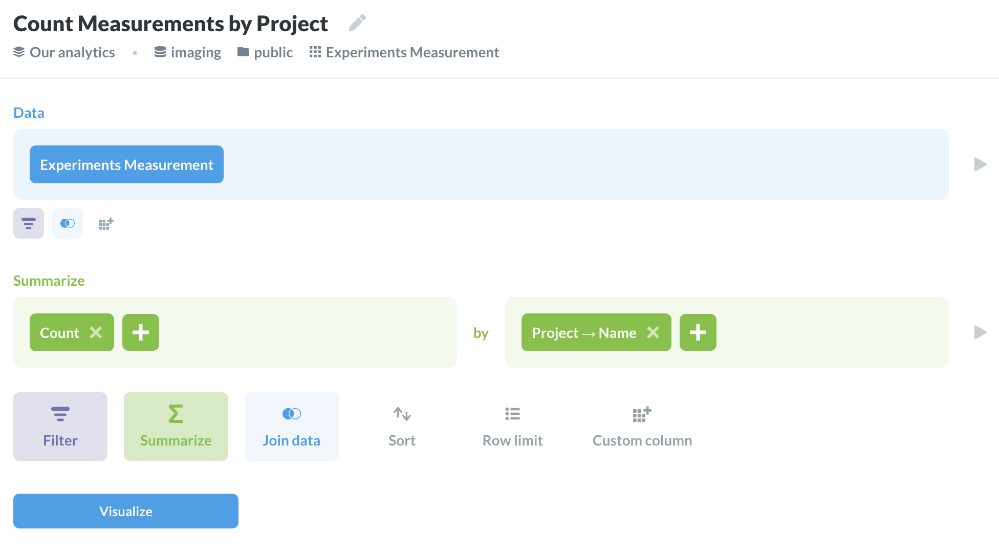

# Metabase

## General 

Connect to the IMTR database (take credentials from IMTR).

## Filter measurements
 
1. Use `measurements.sql` to create a [raw question](https://www.metabase.com/docs/v0.35.3/users-guide/13-sql-parameters.html).

2. Configure field mapping (didn't find a way to automate it). I expect this readme to become obsolete as the schema evolves,
    so update it after changes to `measurements.sql` or don't rely on it later on.
    
    **variable name -> field to map to -> filter widget type**
    - technology -> technology.name -> category
    - mag_bin_overlap -> mag_bin_overlap.name -> category
    - post_stain -> - -> text
    - notes1 -> - -> text
    - notes2 -> - -> text
    - meas_id -> measurement.id -> id
    - tissue -> tissue.name -> category
    - age -> age.name -> category
    - genotype -> genotype.name -> category
    - background -> background.name -> category
    - project -> project.name -> category
    - channel -> channel.name -> category
    - target -> target.name -> category
    - researcher -> researcher.login -> category
    - low_mag_reference -> low_mag_reference.name -> category
    - measurement_number -> measurement_number.name -> category
    - fromdate -> - -> date
    - untildate -> - -> date
    - automated_plate_id -> - -> text
    - automated_slide_num -> - -> text
    - automated_slide_id -> - -> text
    - sample_id -> - -> text
    - slide_barcode -> - -> text
    - image_cycle -> - -> number
    - authorized_projects -> project.id -> id

3. Export the question publicly

## Count measurements by project 

Use "Ask question -> Custom question"

